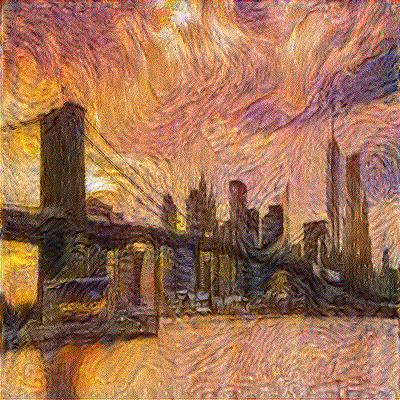
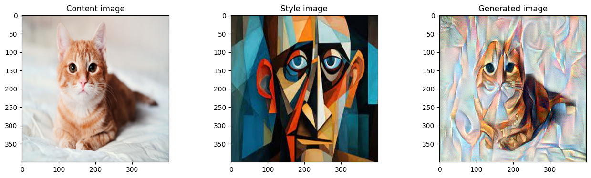
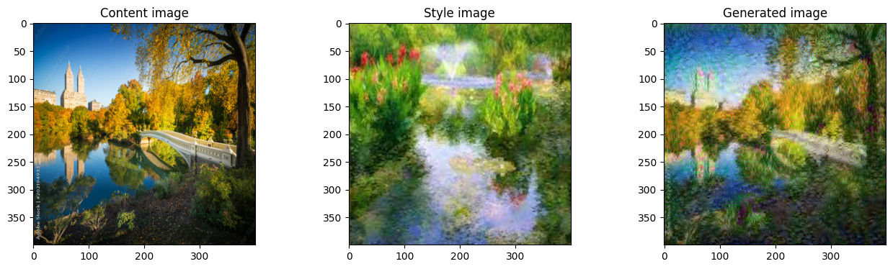

In this [experiment](G_Image_segmentation_Unet.ipynb), I implemented the neural style transfer algorithm, with the starting code, instructions, and utility functions from the [Convolutional Neural Networks](https://coursera.org/learn/convolutional-neural-networks) course (by DeepLearning.AI on Coursera). The algorithm was introduced by [Gatys et al. (2015).](https://arxiv.org/abs/1508.06576)

This algorithm merges a "content" image and a "style" image to create a generated image that has content similar to the "content image" but in the style of the "style image":


# Algorithm

In this exercise, I will separately feed the content and the style images into the VGG neural network (created by the University of Oxford in 2014). 
+ After that, the activations of deeper layers (for the content image) will be an embedding that represents the content.
+ After feeding the style image through the network, the style will be represented by the correlation between different channels of the deeper layer activations (because each channel represents a certain feature in the style image) - according to the NST algorithm.

The algorithm will optimize, not the weight matrices, but the pixel values of a generated image (which begins as a noisy image), such that the generated image has content and style similar to that of the content image and the style image, as expressed in the corresponding deeper layer activations of the generated image. Thus, the originally noisy image will gradually turn into the desired image, through optimization and gradient descent.

Please refer to the course lectures and assignments on Coursera for the mathematical details of the cost functions.



# Process

Please modify the file names here to see the results:

```
content_image_path = "T_images/sunset_brooklyn.jpg"
style_image_path = "T_images/starrynight.jpg"
```

In this example, the style image is Van Gogh's _Starry Night_:


And the noisy initial image (of sunset over Brooklyn Bridge) will gradually be transformed into an image in the style of Starry Night like so:


# Other examples

**Cute cat image in the style of Picasso**



**Central Park's Bow Bridge in the style of Monet**



